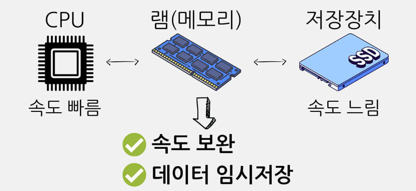
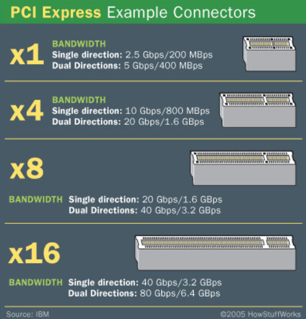

# 데스크탑 컴퓨터 부품 요약

|          부품          |                             역할                             |
| :--------------------: | :----------------------------------------------------------: |
|        **CPU**         |              사람의 **두뇌** - 연산, 처리 담당               |
| **메인보드(마더보드)** |        사람의 **척추** - 모든 부품들과 연결되는 뼈대         |
|     **메모리(램)**     | 사람의 **두뇌 + 기억** - CPU와 보조기억장치 사이에서 데이터 주고 받음 + 데이터 임시저장 |
|    **보조기억장치**    |              사람의 **기억** - 데이터 영구 저장              |
|     **그래픽카드**     |              사람의 **눈** - 이미지와 영상 출력              |
|    **파워서플라이**    |            사람의 **에너지** - 컴퓨터에 전기 공급            |
|       **케이스**       |               사람의 **피부** - 컴퓨터의 외관                |

위 부품들 중에 컴퓨터 성능에 가장 중요한 것은 **CPU**이다.

실사용 시 **CPU**에 따라 컴퓨터의 전체적인 속도가 크게 좌우된다.

 

***

# CPU

**CPU**는 곧 컴퓨터의 속도

**CPU**는 메모리, 보조기억장치와 늘 함께 유기적으로 동작한다.

컴퓨터 내부 부품들은 서로 속도의 차이가 있다.

- 두뇌인 **CPU**가 가장 빠르고 자료를 저장하는 보조기억장치(SSD, HDD)가 가장 느리다.
- **메모리**는 중간에서 **CPU**와 **보조기억장치** 사이에 속도를 보완해주며 명령과 데이터를 저장해 두었다가 **CPU**에 전달한다.

- **CPU**가 너무 빠르고 **보조기억장치**는 너무 느리기 때문에 이런 식으로 작동해야 한다.

램은 용량이 꽉 차면 더 이상 새로운 프로그램 실행이 안 된다.

- 마우스 커서가 제대로 움직이지도 않을 만큼 속도가 저하되기도 한다.
- 그래서 램은 속도 자체가 빠른 것이 좋고 용량이 큰 것이 항상 좋다.

 

## 용도

|                            용도                            |          적정 CPU          |
| :--------------------------------------------------------: | :------------------------: |
|  **웹서핑, 문서작업, 영상 감상, 인강 시청, 저사양 게임**   | 인텔 - i3 / AMD - 라이젠 3 |
|                 **게임, 영상편집, 디자인**                 | 인텔 - i5 / AMD - 라이젠 5 |
|          **고사양 게임, 고사양 영상편집, 디자인**          | 인텔 - i7 / AMD - 라이젠 7 |
| **전문 작업, 고사양 게임, 고사양 영상편집, 고사양 디자인** | 인텔 - i9 / AMD - 라이젠 9 |

 

## 세대

같은 시리즈(e.g. i5, 라이젠 7 등)라도 세대에 따라 성능이 달라지기 때문에 몇 세대 **CPU**인지 확인해야 한다.

 

## 코어

1개의 CPU 안에는 **코어**라는 것이 여러 개 있다. 그래서 여러 개의 코어를 활용하는 것은 여러가지 작업을 동시에 할 때 속도를 높여준다.

 

## 클럭

CPU의 속도를 알아볼 수 있는 **지표**

단위: **GHz**(기가헤르츠)

 

클럭은 높을 수록 그만큼 빠르다는 뜻이기 때문에 좋다.

최근 CPU들은 평소에는 기본 클럭으로 동작하다가 성능이 더 필요해지면 최대 클럭으로 성능을 끌어올리는 기술을 가지고 있다.

&nbsp; &nbsp; &nbsp; &nbsp; └ 기본 클럭보다는 최대 클럭이 어느 정도까지 높은 지를 기준으로 판단하는 것이 좋다.

또한 CPU내의 모든 **코어**가 각각 어느 정도의 클럭까지 올라가는 지가 중요하다.

 

***

# 메인보드(마더보드)

컴퓨터 본체 내의 다양한 부품들을 연결하는 부품

메인보드는 다른 모든 부품들을 연결해주기 때문에 아주 중요한 부품이다.

그래픽카드는 메인보드 상의 **PCIe**(PCI Express) 슬롯에 장착되기 때문에 그래픽카드를 구매할 때 메인보드와 호환이 되는지 확인해야 한다.

최소한 메인보드가 그래픽카드의 인터페이스(PCIe) 이상의 사양을 지원해야 그래픽카드의 성능을 충분히 이용할 수 있다.

 

## PCI Express 슬롯

x1, x4, x8, x16은 **배속**과 **슬롯의 모양**을 의미한다.

예를 들어 x16은 16배속의 속도이며 길이가 가장 길다.(슬롯의 형태가 길어질수록 속도가 빨라진다)

그래픽카드는 x16 형태의 슬롯에만 장착된다고 보면 된다.

x16에 그래픽카드를 장착한다고 항상 16배속으로 동작하는 것은 아니고 평소에는 더 낮은 속도로 동작하다가 성능이 필요해지면 16배속으로 동작한다.

 

## 보조기억장치 인터페이스(연결 부분)

- **M.2**: 얇은 칩셋 형태의 폼팩터로 메인보드의 슬롯에 바로 장착하는 방식
- **SATA**: SATA 케이블을 이용해 메인보드에 연결하는 방식

 

***

# 보조기억장치(SSD)

|        종류        | 상대적 속도 |
| :----------------: | :---------: |
| **SATA(SATA SSD)** |    느림     |
| **PCIe(NVMe SSD)** |    빠름     |

NVMe SSD는 SATA SSD보다 빠르지만 SATA SSD보다 발열이 더 많이 나고 가격이 더 비싸다.

- **2.5"(inch) SATA SSD**: SATA 케이블로 메인보드와 파워서플라이에 연결하는 방식
- **M.2 NVMe SSD**: 메인보드의 M.2 슬롯에 직접 장착하는 방식

M.2 **NVMe** SSD >> M.2 **SATA** SSD = 2.5" **SATA** SSD

