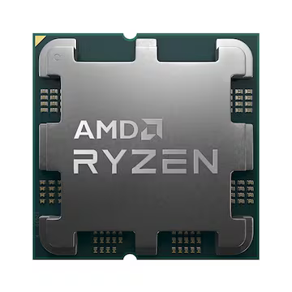

 

# 개념

 

**C**entral **P**rocessing **U**nit

컴퓨터에서 **기억**, **해석**, **연산**, **제어**라는 4대 주요 기능을 관할하는 장치

&nbsp;&nbsp;&nbsp;&nbsp; └ 프로그램의 명령어를 해석하여 데이터를 연산&처리를하고 그렇게 돌아가도록 제어해주는 부분, 혹은 그 기능을 내장한 **칩**

 

***

# 특성

 

CPU는 구매후 부품 교체가 힘들어 사실상 그대로 컴퓨터 메인보드가 수명을 다할 때까지 쓴다고 보면 되고 부품 호환성을 고려하여 교체를 할 수 있는 정도다.

CPU 성능 요소: **클럭 속도**[GHz], **IPC**(**I**nstruction **P**er **C**ycle), **코어 수**

&nbsp;&nbsp;&nbsp;&nbsp; └ 부차적으로 성능 면 외에는 **미세 공정에 따른 발열 감소**, **전력 소모 절감**이 있다.

CPU는 소자를 고도로 집적시킨 부품으로 그래픽 카드의 GPU와 함께 소비전력이 크고 그만큼 열도 많이 발생한다.

조립컴퓨터 견적에서 그래픽 카드와 함께 가장 돈이 많이 드는 부품이다. CPU 외에는 각 부품의 업그레이드가 특정 성능을 올려준다고 하면 CPU 업그레이드는 컴퓨터 전체적인 성능을 올려주는 셈이다.

**CPU**가 그래픽 카드보다 성능이 너무 후지면 그래픽 카드가 아무리 좋더라도 CPU 속도에 맞춰지기 때문에 제 성능을 발휘하지 못한다.

&nbsp;&nbsp;&nbsp;&nbsp; └ 이를 **병목현상**이라 한다. 그러므로 웬만하면 둘 다 비슷한 수준으로 맞춰 줘야 한다.

**오픈월드**나 **시티 빌드**, **전략 시뮬레이션**처럼 갈수록 데이터가 쌓이는 장르의 게임은 특히 CPU의 성능이 더 중요시 된다.

