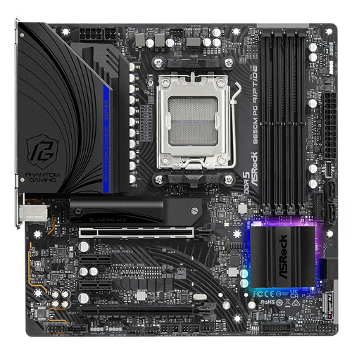
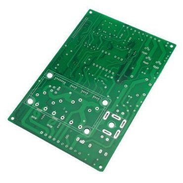

 

# 용어

 

- 국내: 메인보드(mainboard)

- 해외: 마더보드(motherboard), 시스템보드(system board)

- 북미: mobo

 

***

# 특성

 

컴퓨터의 각 부품에 전원을 공급하고 부품 간에 신호를 주고받는 통로를 담당하므로 **순환계**이면서 **신경계**로 비유된다.

&nbsp;&nbsp;&nbsp;&nbsp; └ [**순환계**] 메인보드 자체도 컴퓨터의 **심장**에 비유되는 **파워서플라이**로부터 전원 케이블을 통해 전력을 공급받으며 각각의 부품들을 작동시키기 위한 전력도 메인보드를 통해 공급된다.

&nbsp;&nbsp;&nbsp;&nbsp;&nbsp;&nbsp;&nbsp;&nbsp; └ 혈관이 심장과 이어져 뇌, 장기, 근육 등의 조직과 연결되어 혈액을 공급하는 것과 비슷하다.

&nbsp;&nbsp;&nbsp;&nbsp; └ [**신경계**] 각 부품들은 데이터 케이블이 연결되어 부품 내부에 저장된 데이터들이 메인보드를 거쳐서 전달된다.

&nbsp;&nbsp;&nbsp;&nbsp;&nbsp;&nbsp;&nbsp;&nbsp; └ 사람의 **뇌**(**CPU**)로부터 명령을 받아 말초 신경계를 통과하여 신체가 움직이기(주요 및 확장 부품들의 작동) 위해서는 무조건 반사를 제외한 나머지 행동들이 반드시 중추 신경계(메인보드)를 통과해야 하는 것과 비슷하다.

 

파워 서플라이와 비슷하게 컴퓨터의 안정성을 좌우하는 제품이다. 컴퓨터 성능과는 직접적인 연관성은 없지만, 보드의 품질에 따라선 확장성과 오버클럭을 좌우하기도 한다.

&nbsp;&nbsp;&nbsp;&nbsp; └ **저가형 메인보드**일 경우 대역폭이 떨어지는 경우 **오버클럭**이 안되는 경우가 많고, 추가 부품을 꽂을 수 있는 소켓도 적게 제공되기 때문에 **확장성**도 협소하다.

&nbsp;&nbsp;&nbsp;&nbsp;&nbsp;&nbsp;&nbsp;&nbsp; └ 요즘에 안정성이 체감할 수준으로 떨어지는 일은 근래 들어서는 드물지만 저가형 메인보드가 안정성에는 문제가 없더라도 **수명이 짧을 수 있음**을 유의해야 한다. 게다가 오디오 포트에서 노이즈가 심하게 난다던지 하는 **잡스러운 문제**도 주로 저가형 메인보드에서 나타나는 문제다.

교체가 가장 힘든 부품 중 하나이며, 조립 컴퓨터 업체에서 파워 서플라이와 더불어 가장 많이 장난을 치는 부품이다.

Windows 운영체제는 메인보드가 교체되었을 경우 별개의 컴퓨터로 인식한다. 즉 Windows가 설치된 컴퓨터에서 메인보드는 그대로 두고 다른 부품을 아무리 교체하거나 추가해도 Windows가 그 컴퓨터를 별개의 컴퓨터로 인식하지 않지만, 다른 부품은 전부 그대로 두고 메인보드를 교체할 경우 Windows는 자기가 설치된 컴퓨터가 바뀌었다며 정품 인증을 취소시켜 버린다.

컴퓨터의 **펌웨어**인 **UEFI**(과거에는 **BIOS**)는 메인보드의 ROM에 위치하고 있다.

    <b>CMOS 배터리</b>: 메인보드에 전원 공급이 완전히 차단되더라도(즉 컴퓨터의 전원 코드를 콘센트에서 완전히 분리하더라도) BIOS의 각종 설정이 날아가지 않게하는 <b>메인보드에 설치된 작은 건전지</b>

최근에는 NVRAM을 사용하기 때문에 전원이 차단되더라도 10년 정도는 데이터가 보존되지만 예전부터 CMOS 배터리를 분리하는 것으로 BIOS를 초기화했기 때문에 관습상 CMOS 배터리가 제거되면 BIOS가 초기화되도록 매커니즘을 만들어 둔다.

현재의 메인보드에서 **CMOS 배터리**는 컴퓨터의 시계인 **RTC**(**R**eal **T**ime **C**lock)를 구동하기 위해서만 사용된다.

 

**CMOS 배터리** 또한 건전지이므로 수명이 있으며, CMOS 건전지인 CR2032 리튬 배터리의 경우 건전지 제조사에 따라 짧으면 3년 정도이고 길게 쓰면 9~10년 정도 쓴다. 이 배터리가 수명이 다하면 컴퓨터에 전력 공급이 차단될 때마다 위 매커니즘에 의해 BIOS 설정을 다시 해줘야 한다.

**CMOS 배터리**가 수명이 다 되어도 컴퓨터가 사용자에게 알려주지 않기 때문에(최근에는 부팅시 Low Batter라고 알려주는 BIOS도 있다) 모르고 지낼 수 있는데, **CMOS 배터리**가 방전되면 **온갖 이상한 오작동**이 일어나 **BIOS 셋업을 할 수 없다든지**, **컴퓨터 날짜와 시간이 계속 틀리는 경우는 일상**이고 심한 경우에 파워서플라이가 고장도 아니고 스위치도 작동 상태로 되어있는데도 **컴퓨터 본체 전원 버튼을 눌러도 아예 안켜지는(무반응)** 등의 여러 이해할 수 없는 문제가 일어나는 경우가 있다. 그럴 때는 CMOS 배터리가 방전된 게 아닌지 확인해보는 것이 좋다.

 

***

# 구성요소

## PCB(Printed Circuit Board)

번역: **인쇄 회로 기판**

명칭이 메인**보드**인 만큼 수많은 장치들이 탑재될 **기반**이 되는 부품

도체와 절연체가 기판 형태의 적층된 구조로 되어 있고 **반도체**, **커패시터**, **저항** 등 각종 부품을 장착할 수 있으며 부품 간의 전기적인 연결을 하는 역할을 한다.

PCB는 전기 선로를 효율적으로 설계할 수 있도록 함으로써 전자기기 크기를 줄이고 **성능** 및 **생산성**을 높이며 서킷 디자인의 최종 구현을 위해 필수불가결한 **커스텀 전자 부품**이다.

 

## 칩셋

서로 다른 부품들 사이의 중간다리 역할을 하며, 부품들이 서로를 인식하게 만든다.

 

## 전력 공급 단자

파워서플라이로부터 메인보드로 전력을 공급하는 부품

메인보드에는 CPU, 메모리, 그래픽 카드 등의 부품들이 연결된다. 이 부품들 모두, 심지어 메인보드 자신조차도 전력 공급 없이는 작동할 수 없으므로 파워서플라이에서 전원을 공급 받아야 한다. 하지만 칩셋에 직접 파워 연결 단자를 연결할 수는 없는 노릇이라 메인보드에 전력 공급을 하는 방법은 아래와 같이 다양해진다.

- 20핀 연결
- 24핀 연결
- 10핀 연결
- 4 + 4핀 연결
- 6 + 2핀 연결

 

## 전원부

전력 공급 단자 -> CPU, 메모리, I/O 등의 기타 칩셋들로 **효율적**이면서 **안전하게** 전달해주는 매우 중요한 부품

