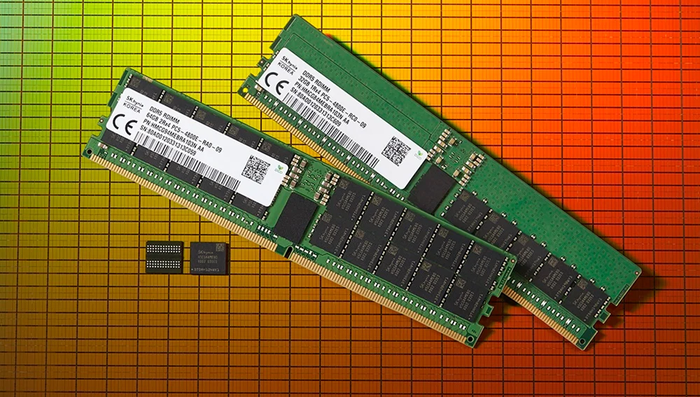

 

# 용어

 

(통상적으로)

**시스템 메모리**(System Memory)

= **메인 메모리**(Main Memory)

= **메모리**

= **주 기억장치**

= **램**(RAM)

 

***

# 디스크 페이징

 

**디스크 페이징**(= 스왑, 스와핑)

RAM의 용량을 보조하기 위하여 더 대용량인 SSD같은 보조기억장치를 통해 일부 영역을 메인 메모리 용도로 전용하여 사용하는 것

메인 메모리로 쓰이는 램과 보조기억장치로 사용하는 저장매체의 속도 차이가 워낙에 크기 때문에 **디스크 페이징**을 하는 상태가 되면 그 순간 **컴퓨터의 속도가 답이 없어질 만큼 느려진다.**

 

***

# 메모리의 성능

 

## 메모리 레이턴시(latency)

메모리에 있는 데이터에 대한 요청부터 검색 완료될 때까지의 **접근 시간**(= 참조 시간, 대기 시간, 지연 시간).

만약 데이터가 캐시 메모리에 없을 경우 메인 메모리와 직접 통신해야 하므로 데이터를 얻기까지 더 긴 시간이 걸린다. 따라서, 접근 시간이 짧을 수록 작업 속도가 짧아진 접근 시간만큼 빨라진다.

보통 **레이턴시**라고 하면 클럭 주파수의 역수(주기) 개념이 아니라, 참조/지연/대기/**접근 시간** 개념을 가리킨다.

 

## 메모리 쓰루풋(대역폭)

**Memory Throughput**

**단위 시간 동안** 메모리의 데이터를 읽기, 쓰기, 저장할 수 있는 **처리량**이며 줄여서 **처리율**이라고도 부른다.

 

**처리량**: 하나의 전송 채널에서 처리되는 데이터의 양

**대역폭**: 여러 개의 전송 채널을 통해 처리되는 데이터의 양

**전송량**: 데이터 전송 작업의 수

**전송률**: 단위 시간 동안 데이터 전송 작업의 수

 

**전송량**과 **전송률**은 전송 그 자체에만 의미를 두는 개념이고, **처리량**&**대역폭**은 전송뿐만 아니라 읽기, 쓰기, 저장같은 일련의 작업 과정까지 포함하는 개념이다.

사용자들은 데이터 '전송'보다는 데이터 읽기, 쓰기, 저장까지 완료된 상태에 관심이 있기 때문에 **전송량** & **전송률**보다는 **처리량** & **처리율**, **처리량** & **처리율**보다는 **대역폭**이 더 현실적인 단위 개념이라고 볼 수 있다. 메인 메모리가 일찍부터 하나의 전송 채널이 아니라 여러개의 전송 채널 구성으로 발전되어 왔기 때문이다.

일반적으로 바이트/초 단위로 표기하며, 대역폭을 기준으로 **(메모리 클럭 속도)** × **(메모리 버스 폭)** × **(메모리 채널 수)**로 계산한다.

제품에 표기된 메모리 대역폭은 이론적인 최대 대역폭으로 실제 대역폭은 표기상 대역폭보다 작게 측정되며, 표기 대역폭에 도달했다 해도 지속적이지 않을 수 있다.

메모리 대역폭의 경우 표기 명칭이 통일되어 있지 않아 **MHz**, **Mbps**, **MT/s** 전부 사용하고 있는데 보통 일반적으로는 **MHz**를 주로 사용한다.

 

***

# 다다익램

 

같은 대역폭의 램 2개를 장착하면 속도가 두 배로 뻥튀기 된다.

램 정보를 보면 25600, 38400 등이 써져있는데, **대역폭**을 가리키는 것이며 이는 동작 클럭의 8배이다. 예를 들어, 클럭이 3200MHz이면 대역폭은 3200 × 8 = 25600MB/s이다.

다만 두 개의 대역폭이 다를 경우 낮은 쪽의 대역폭으로 맞추어진다.

Windows 운영체제 사용자라면, 자신의 컴퓨터에서 메모리 점유율이 70% 이상을 보일 시 메모리 용량이 부족하다는 신호로 간주해야 한다. 메모리의 용량이 꽉차는 메모리 오버플로는 블루스크린을 일으키는 대표적인 원인이다. 따라서 컴퓨터는 최대한 메모리를 덜 쓰려는 시스템을 갖추고 있고, 안정된 작동을 위해 메모리 용량이 부족하지 않더라도 최대한 가상 메모리 등을 끌어다 쓴다. 메모리 잔여량이 부족해지면 더욱 적극적으로 가상 메모리를 사용하게 되고, 그에 따른 성능 저하가 관측되는 시점이 메모리 용량의 70% 정도를 사용하는 시점이다.

 

***

# 논리적 용도별 종류

 

해당 메모리 분류는 물리적인 특성과는 상관 없이, **용도**에 따라 분류하였다.

## 메인 메모리

시스템이 동작하는데 있어서 반드시 존재해야 할 메모리로, 컴퓨터에 탑재된 각종 메모리들 중에서 가장 중요한 메모리이므로 **시스템 메모리**라고도 부른다. BIOS가 담겨진 ROM과 함께 취급하고 있다.

**Random Access** 즉, 임의 접근하여 자유롭게 읽고 쓸 수 있다는 특징이 있다.

컴퓨터는 CPU에서 이뤄진 연산을 메모리에 기록하며 또 메모리로부터 읽어온다.

&nbsp;&nbsp;&nbsp;&nbsp; └ 복잡한 계산을 할 때 공책에 풀이해 가면서 하는 것과 비슷하다.

 

## 버퍼 메모리

서로 다른 두 곳에서 데이터를 이동할 때 그 데이터가 누락되지 않고 완전하게 이동할 수 있도록 임시로 보관하기 위한 **버퍼** 기능을 수행하는 메모리. 컴퓨터가 여러 장치들로 구성되어 있는 한, **버퍼**라는 존재를 배제할 수 없을만큼 매우 중요한 용도이다.

**[Usage]**

- SSD 캐시 겸 버퍼
- 그래픽 카드의 그래픽 메모리에 일부 영역으로 할당된 프레임 버퍼
- 메인 메모리로 사용되는 시스템 메모리도 일부 영역은 버퍼로 사용됨

 

## 캐시 메모리

시스템의 **성능 향상을 위해** 캐시 기능을 수행하는 메모리. 메인 메모리와는 다르게 이것이 없어도 작동하는데 문제는 없다. 다만, 없으면 속도가 느려지기 때문에 더 나은 유저 경험을 위해 사실상 필수가 된 용도이다.

CPU와 메인 메모리의 데이터 교환 속도를 향상시키기 위해 오직 캐시 기능만을 수행할 전용 메모리 즉, 캐시 메모리가 등장했으며, 그것도 모자라 CPU 내부에 내장되었기 때문에 현 세대 시스템에서는 캐시 메모리를 직접 보기가 어려워졌다. 주로 **SRAM**이 사용된다.

 

***

# 물리적 특성별 종류

 

해당 RAM 분류는 용도에 상관없이, **물리적인 특성**에따라 분류하였다.

데스크탑 PC와 일반 노트북에는 **DDR SDRAM**, 스마트폰과 태블릭 컴퓨터와 저전력 노트북에는 **LPDDR SDRAM**, 그래픽 카드에는 **GDDR SGRAM**이 주로 사용된다.

 

## 휘발성 RAM

### SRAM

**S**tatic **R**andom **A**ccess **M**emory

정적 램이라고도 부르며, 내용을 한번 기록하면 전원이 공급되는 한 내용을 그대로 가지고 있는 램이다. 기본적으로 트랜지스터 등으로 구성된 논리 회로로 이루어지며 외부 신호에 따라 내부의 값을 유지하는 식으로 정보를 기록한다. 기억 능력을 가진 논리 회로를 특별히 **플립플롭**이라고 부른다.

SRAM은 리프레시가 필요없기에 리프레시를 필요로 하는 DRAM의 100배 이상으로 접근 속도가 빠르지만 구조가 복잡하여 공간을 많이 차지하므로 집적도를 높이기 어려워 가격이 비싸고 대용량으로 제작하기가 어렵다. 그래서 빠른 속도가 요구되는 캐시 메모리(Cache Memory)에 주로 사용된다. CPU 스펙에 표시되는 L1, L2, L3 등의 캐시 메모리가 대표적이다.

SRAM이라서 무조건 캐시에만 써먹으라는 법은 없으며 메모리가 많이 필요하지 않은 곳에는 메인 메모리로도 쓰인다. 특히 임베디드에서는 SRAM을 내장한 칩도 흔하다.

DRAM과 달리 리프레시를 위한 추가 회로가 필요하지 않다는 장점이 있다. 이런 장점들 덕분에 수은전지 등의 전원을 SRAM에 연결해서 보조기억장치처럼 쓰는 사례도 많았다.

&nbsp;&nbsp;&nbsp;&nbsp; └ 이러한 방식은 옛날 수 많은 게임 카트리지에 사용되었으며 대표적으로 초기의 포켓몬스터 시리즈가 있다.

 

### DRAM

**D**ynamic **R**andom **A**ccess **M**emory

 

DRAM(동적 램)은 기록된 내용을 유지하기 위해 주기적으로 Refresh(재충전)이 필요하다. 기본적으로 Capacitor(축전기)로 이루어지며 이것의 충전 상태로 정보를 기록한다. 계속 재충전해야 하는 이유는 캐퍼시터가 시간이 지나면 저절로 방전되기 때문이다.

DRAM은 속도가 SRAM보다는 느리지만 구조가 간단하여 집적도를 쉽게 높일 수 있다. 또한 SRAM에 비해서 가격이 매우 싸고 전력 소비도 그렇게 많지 않아 CPU의 메인 메모리로 가장 많이 사용되고 있다.

우리가 말하는 '**램**'이나 '**메모리**'는 보통 DRAM이다.

 

#### SDRAM

**S**ynchronous **D**ynamic **R**andom **A**ccess **M**emory (SRAM이랑 DRAM을 합친 것이 아님)

2000년에 DDR 방식의 메모리가 나오자 기존의 SDRAM을 구분하기 위해 SDR(Single Data Rate) SDRAM으로 통용되고 있는데, 클럭 사이클당 한 번만 전송을 하는 것에서 명명했다.

 

##### DDR SDRAM

**D**ouble **D**ata **R**ate **S**ynchronous **D**ynamic **R**andom **A**ccess **M**emory

기존 SDRAM에 비해 메모리 대역폭이 2배 늘어난 것이 주된 특징으로, 상승 에지(Rising Edge)와 하강 에지(Falling Edge) 두 개를 모두 데이터를 전송하는 용도로 사용한 것이 DDR SDRAM의 기원이다. SDR SDRAM은 상승 에지에서만 데이터를 전송한다.

 

#### GDRAM

**G**raphics **D**ynamic **R**andom **A**ccess **M**emory. 그래픽 DRAM.

 

##### VDRAM

**V**ideo **D**ynamic **R**andom **A**ccess **M**emory. 비디오 DRAM.

현재는 VRAM을 그냥 그래픽용 메모리를 지칭하는 것으로 주로 사용된다.

 

***

# 가격 변동

램은 굉장히 가격 변동이 심한 편이다.

램은 다른 부품과 달리 생산라인이 극도로 편중되어 있고(2020년대 기준 삼성전자, SK하이닉스, 마이크론 3사 점유율이 90% 이상) 생산하는 회사의 총 생산량은 거의 변하지 않으므로 **수요와 공급**에 따라 가격이 빠르게 변화한다. 

많은 사람들이 컴퓨터를 교체하는 시기(주로 다음 세대의 CPU나 그래픽 카드가 출시되었을 때)나 대기업 회사들이 서버확충 등을 위해 컴퓨터 자원을 대량으로 구축하려고 할 때 등의 시기에 **램의 가격이 굉장히 비싸진다.**

무난한 시장이라면 생산업체들의 가격경쟁으로 인해 점차 **가격이 내려가며 안정화** 된다.

일례로 가장 많이 소비되었던 삼성 DDR4 8GB 램을 기준으로 보면 가장 비쌌을 때는 2017년 10월 16일 기준 148,290원이었고, 3년뒤 2020년 8월에 가장 저렴한 가격 28,300원까지 내려갔었다. 이렇게 동일한 제품의 가격이 시기에 따라 무려 5배가 넘는 가격 차이를 기록했다.

 

***

# 기타

 

램에는 용량뿐 아니라 데이터 전송 속도도 중요한데, 램을 여러 개 꽂을 때 전송 속도가 다르면 낮은 쪽에 맞춰진다.

듀얼 채널 메모리를 구성하면 **메모리를 많이 이용하는 작업에서 속도 향상**이 있다.

삼성전자의 방열판이 없는 RAM 모듈을 **시금치램**이라 부른다. 삼성전자가 SDRAM을 만들던 시절부터 오로지 녹색 기판만 사용해서 그렇다.
